## Included

1. nmap -sC -sV -Pn IP

	- Port 80: Web Server
	
	- Visited website
	
		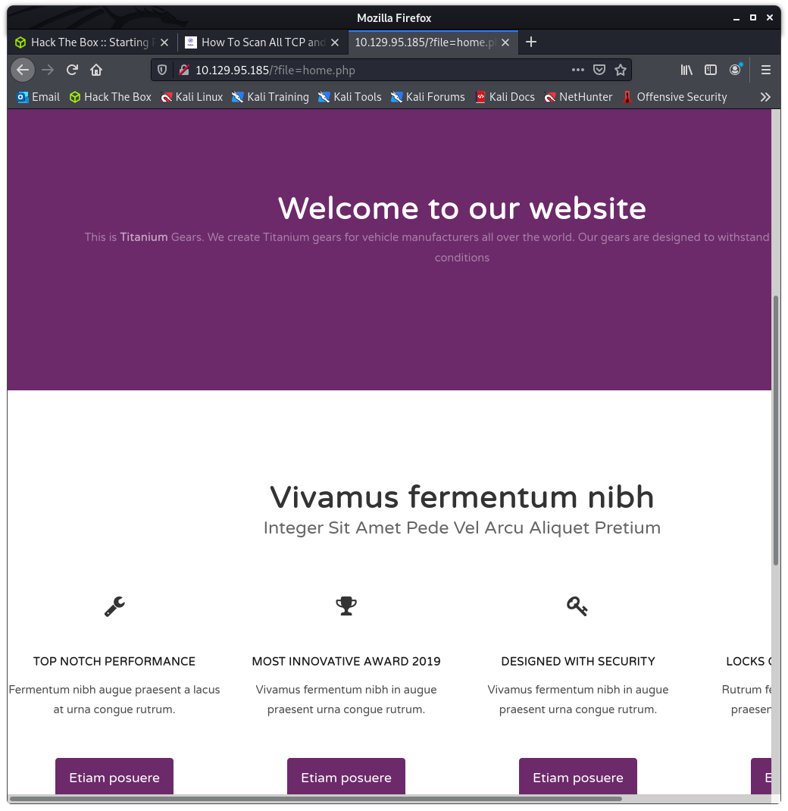
	
	- Tried to play with the `?file=home.php`
	
	- Possible local file inclusion (LFI) vulnerability

		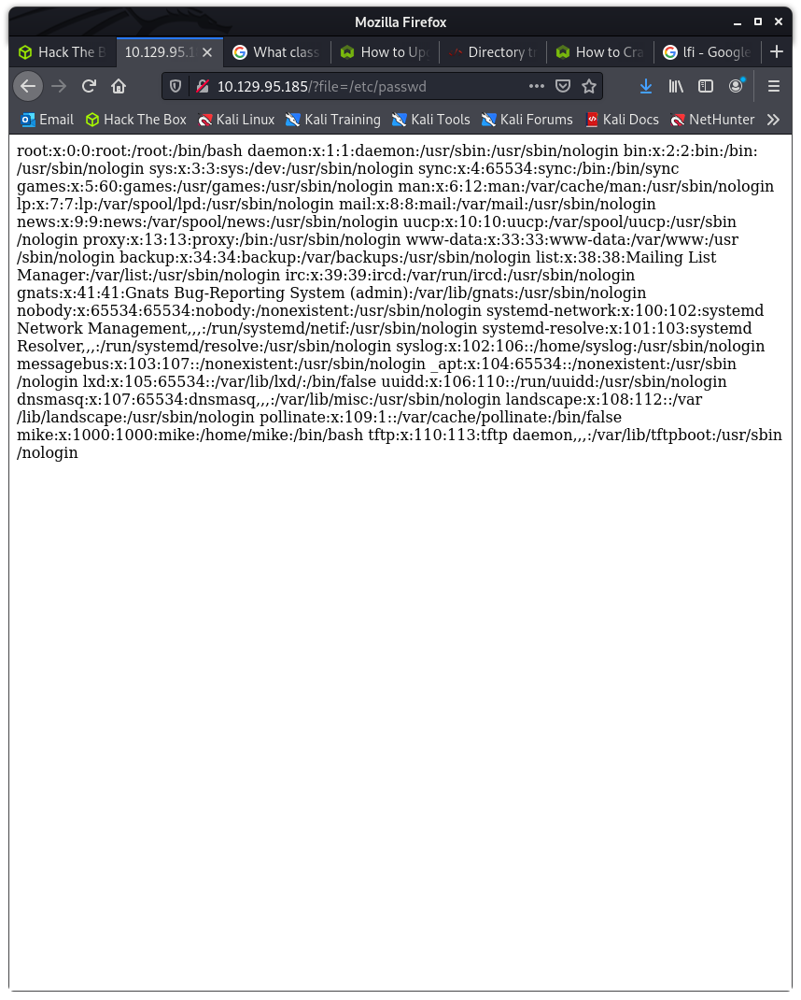
		
		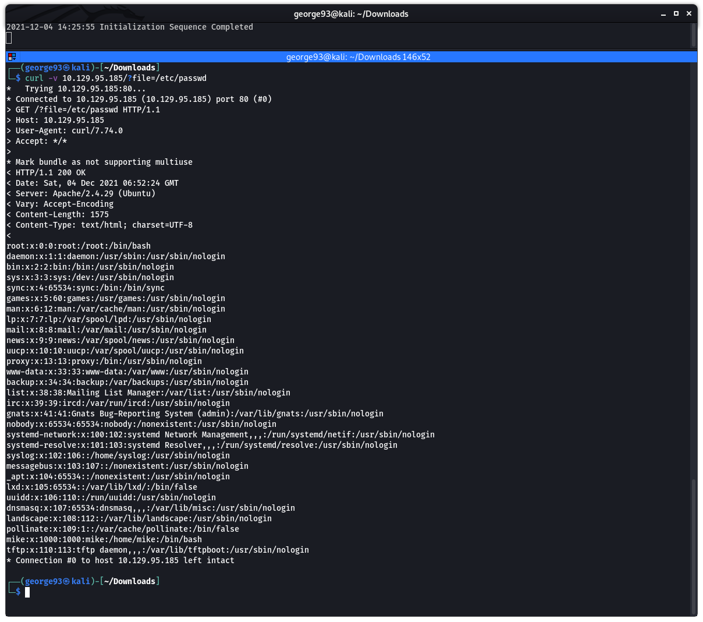
		
2. Try scanning UDP ports (takes much longer)

	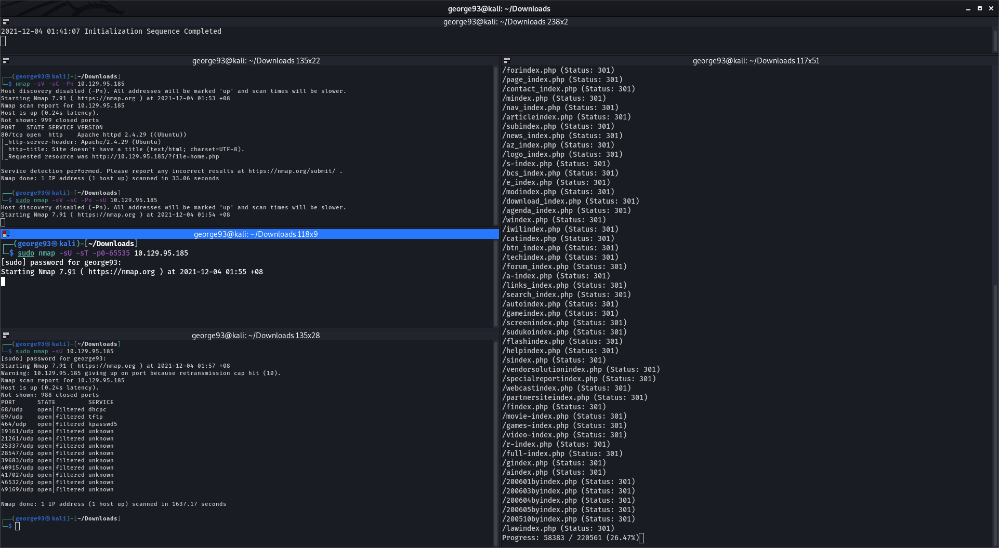
	
3. TFTP seems to be vulnerable after much googling, let's try to connect to it! Run `?` to get help. Cheatsheet found [here](https://www.tutorialspoint.com/unix_commands/tftp.htm).

4. Can't seem to put or get anything from tftp server, seems to be cause for ufw as seen from [here](https://forum.hackthebox.com/t/starting-point-included-machine-need-help/2748)

	

5. Disable firewall and add reverse shell to tftp server. Reverse shell obtained from [here](https://github.com/pentestmonkey/php-reverse-shell/blob/master/php-reverse-shell.php)

	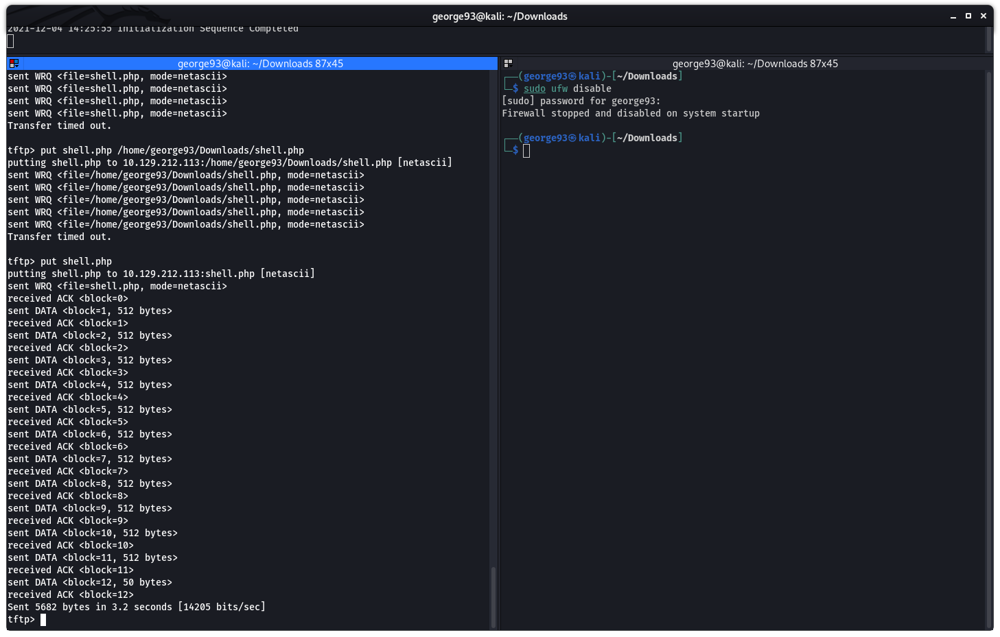

6. Connect to uploaded reverse shell using nc (remember to re-enable firewall and allow from port of your choice)

	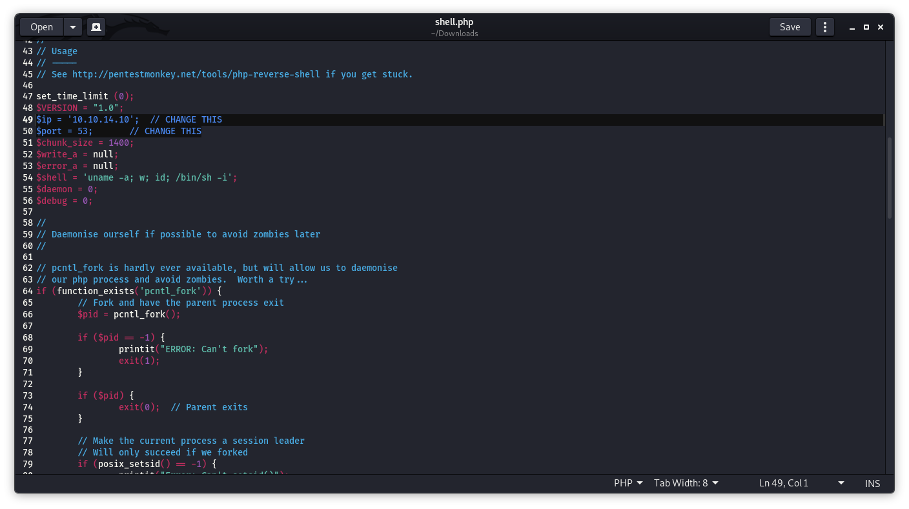

	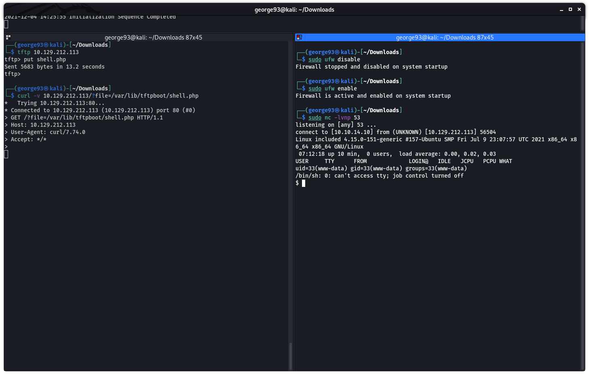

7. Permission denied from using `cat` and cannot use sudo on dumb shell hence need to upgrade shell. Followed [this](https://blog.ropnop.com/upgrading-simple-shells-to-fully-interactive-ttys/) link

	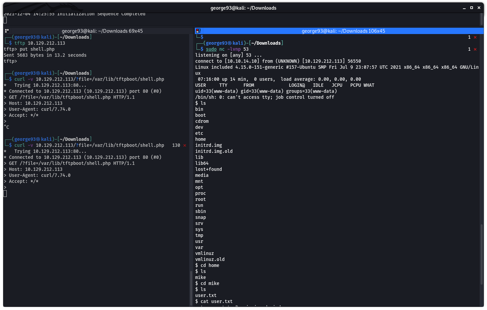

	

	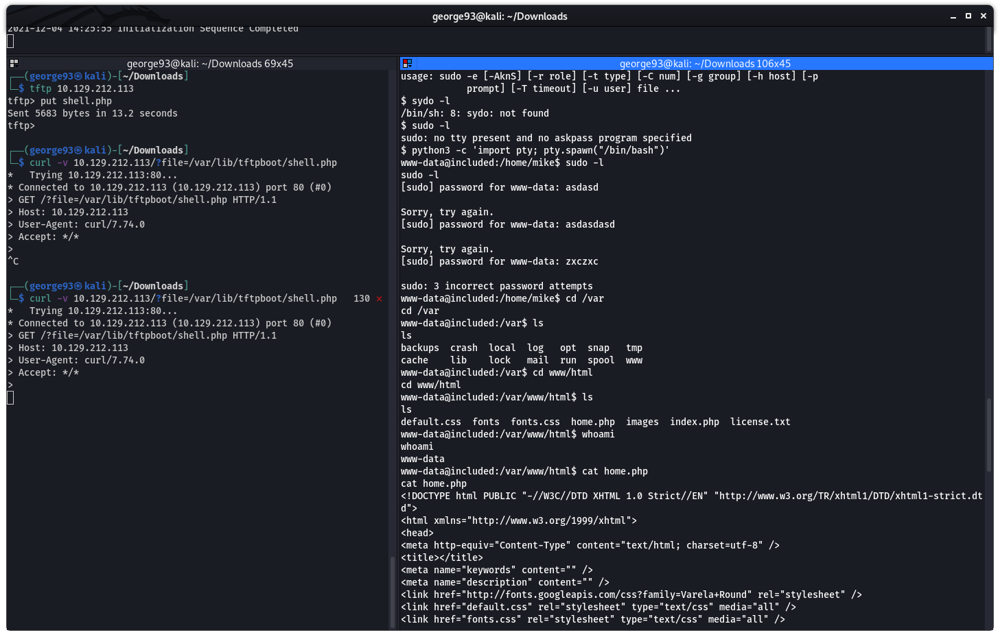
	
8. Could not find anything, tried `ls -al` instead for hidden hiles (ALWAYS DO THIS)

	
	
9. login as mike and read user.txt

	
	
10. when we run `id` we realise that mike can run `lxd`, so what is this lxd? It is a container manager service for linux!

	- [link 1 in lxc/lxd](https://ubuntu.com/server/docs/containers-lxc)
	
	- [link 2 in lxc/lxd](https://ubuntu.com/blog/lxd-in-4-easy-steps)
	
11. lxc can be used to raise privileges!

	- [link 1 on privilege escalation via lxd/lxc](https://book.hacktricks.xyz/linux-unix/privilege-escalation/interesting-groups-linux-pe/lxd-privilege-escalation)

12. However most solutions on Google require internet access and dns routing which our host does not seem to have as we are experiencing errors as seen [here](https://discuss.linuxcontainers.org/t/error-failed-container-creation-create-container-from-image-failed-to-clone-the-filesystem/4829/9) and in the screenshots below

	

13. Followed this [exploit](https://jdroberts96.medium.com/hackthebox-writeup-tabby-25d58a3ec0d) which basically uses our kali machine to download the resources, setting up a server, and getting our resources from our kali machine which the host can access via VPN

	

	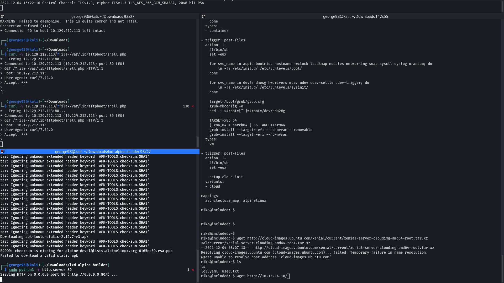
	
	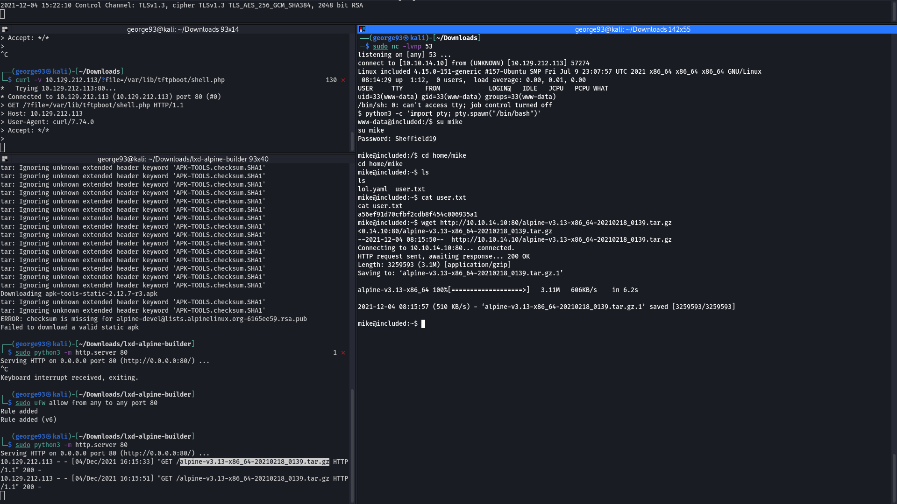

14. obtain root flag :D

	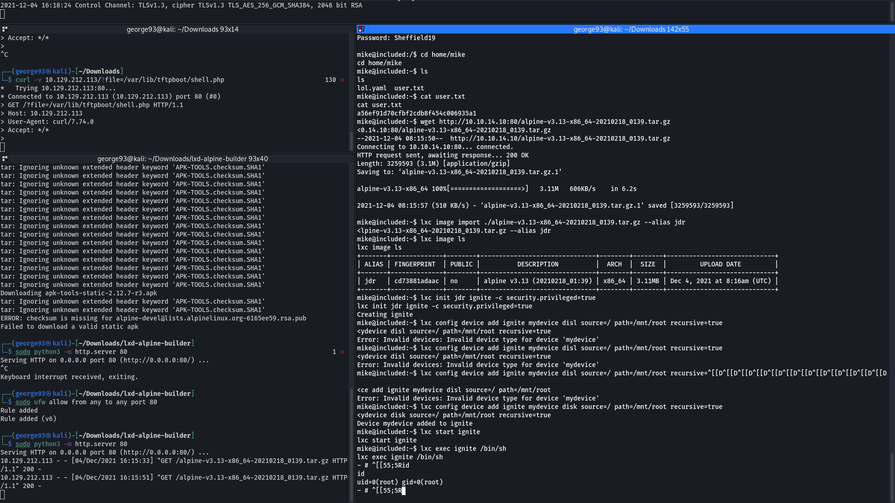
	
	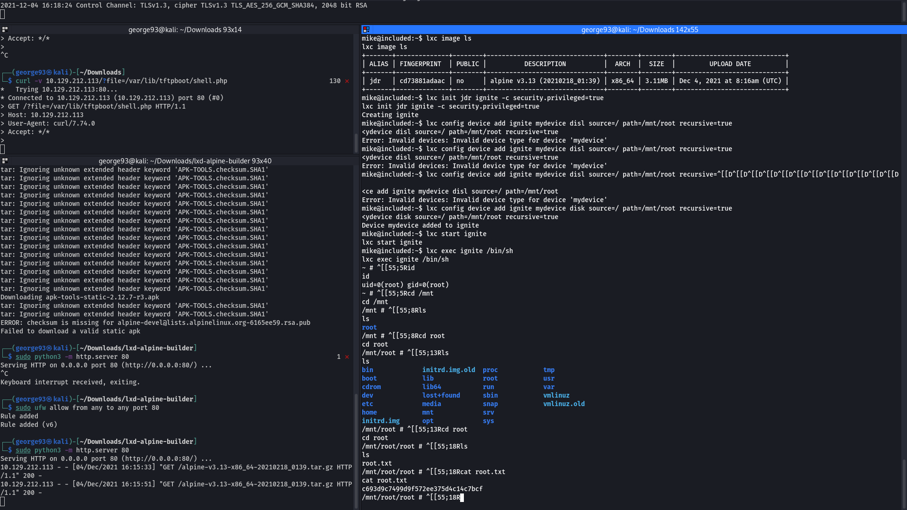

## Additional stuff which may be relevant in the future

- [Directory traversal attack](https://portswigger.net/web-security/file-path-traversal)

- [Cracking password hashes in /etc/shadow](https://null-byte.wonderhowto.com/how-to/crack-shadow-hashes-after-getting-root-linux-system-0186386/)

- [nmap for OSCP](https://medium.com/vieh-group/hacking-oscp-cheatsheet-ef63c43f919c)