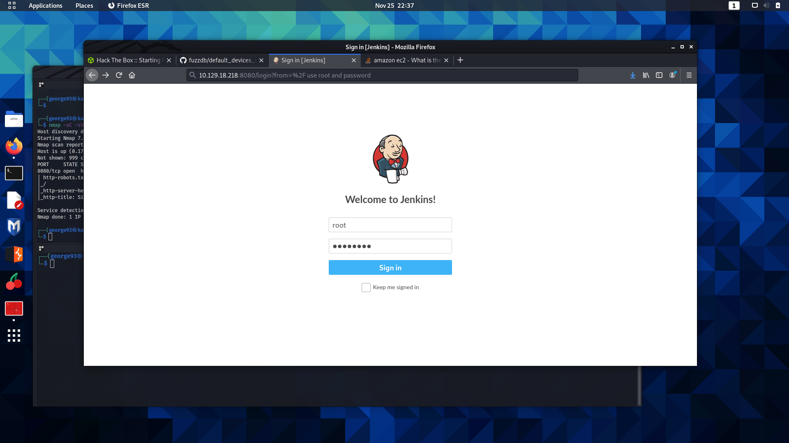
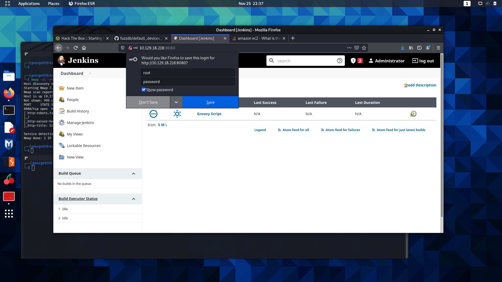
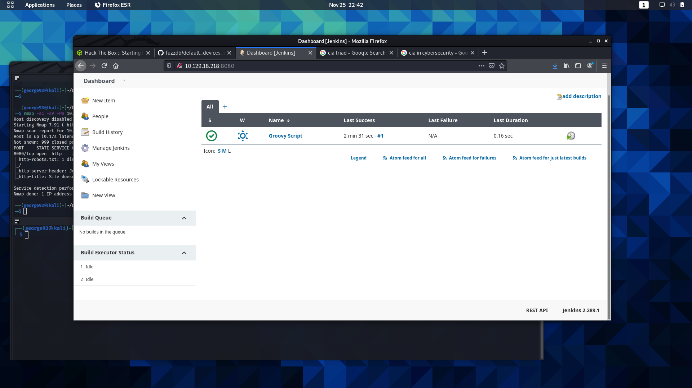
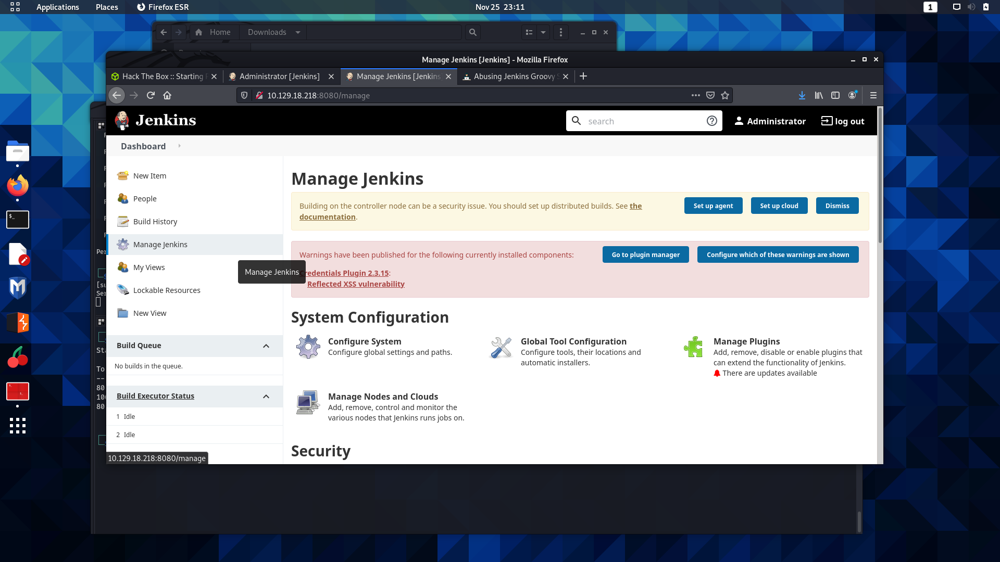
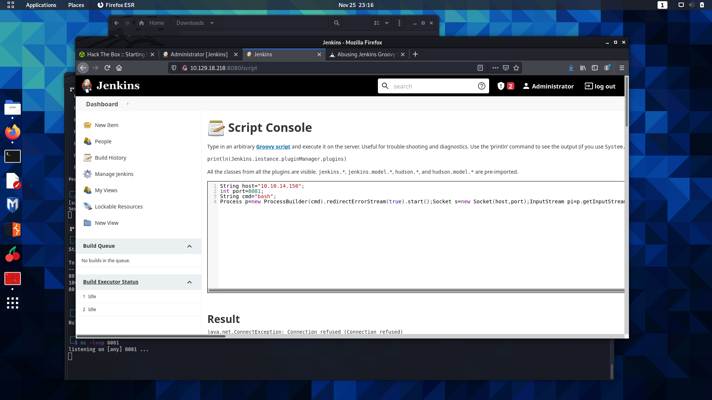
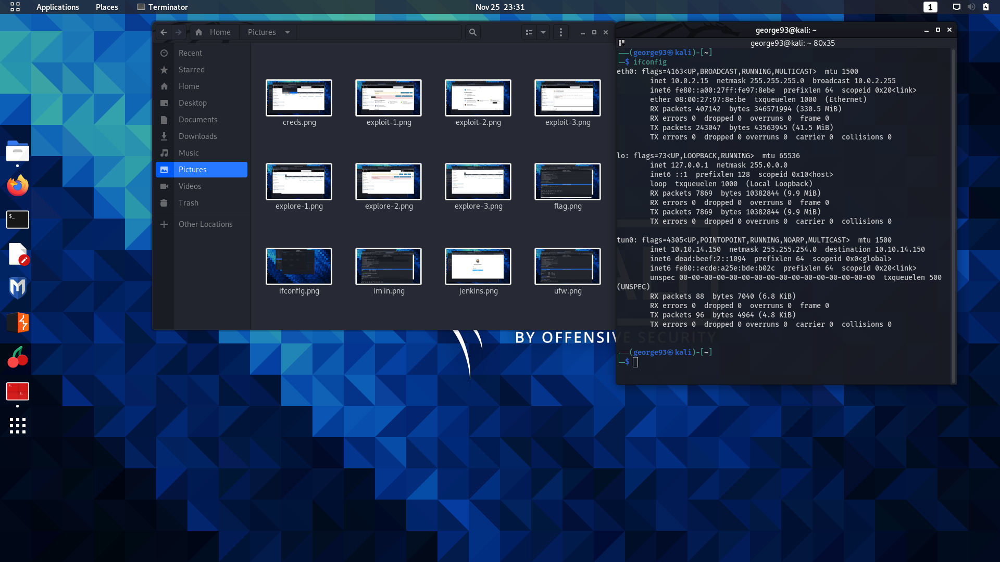
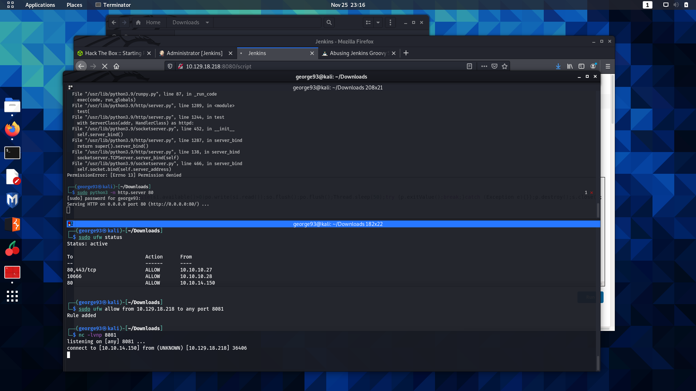
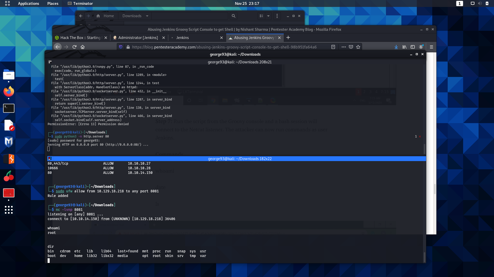
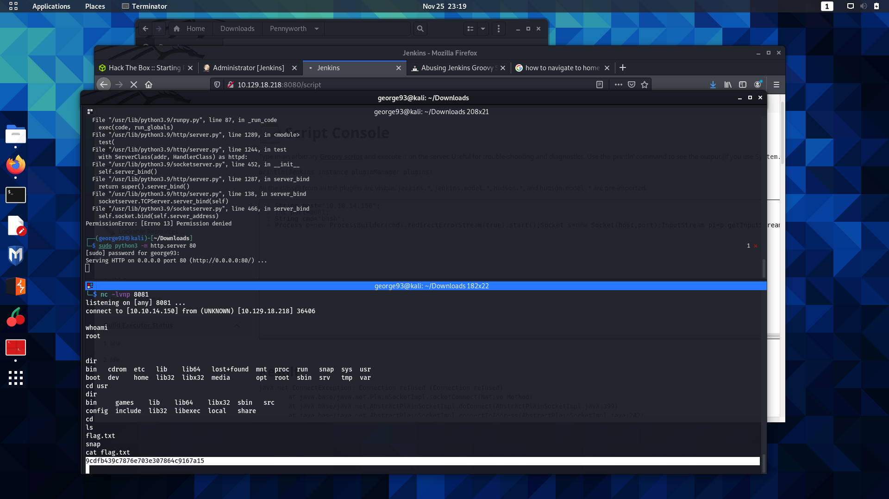

## Pennyworth

1. ping enumerate target using nmap

	```
	ping IP
	nmap -sC -sV -Pn IP
	```

	Did not take screenshot oops
	
2. Port 8080, Jetty (Jenkins Server)

	
	
3. Use commonly used default credentials again to login to server
	
	

	[Link for default credentials here!](https://github.com/nixawk/fuzzdb/blob/master/bruteforce/passwds/default_devices_users%2Bpasswords.txt)

4. Let's explore the server and try to mess around with it

	
	
	
	
	
	
5. There seems to be many vulnerabilities when it comes to Jenkins

	- [Jenkins RCE 1](https://medium.com/@adamyordan/a-case-study-on-jenkins-rce-c2558654f2ce)
	
	- [Jenkins CVE Details id-15865](https://www.cvedetails.com/vulnerability-list/vendor_id-15865/opec-1/Jenkins.html)

	- [Absuing Jenkins Groovy Script Console to get Shell (ended up using this one!)](https://blog.pentesteracademy.com/abusing-jenkins-groovy-script-console-to-get-shell-98b951fa64a6)

6. Exploited vulnearbility

	
	
	
	
	
	
7. Before running the script, must enable firewall to allow connections to host on specified port

8. Get my IP from tun0 (VPN interface)

	
	
9. Set up ufw and start listening on specified port using nc

	
	
10. Obtain shell

	
	
11. Obtain flag

	