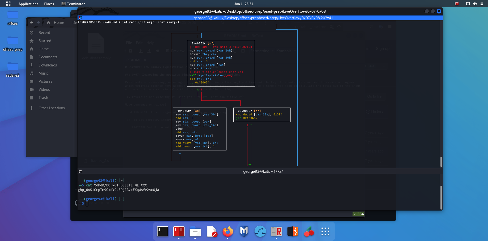

# LiveOverflow Binary Exploitation / Memory Corruption

### 0x07: Improving the previous binary - key validation algorithms

Previously on reversing, we managed to reverse the binary license_1 and find out the key! To counter this we need to create a program which verifies license keys without hardcoding the key itself. For this, we use a simple for-loop to calculate the total sum of the input and match it to a certain value (in this case is 0x394 or 916)

Try reversing and cracking it using gdb & radare2 (not too difficult)

### More commands on radare2:

`ood ARGUMENT` to add argument before running program using `dc`

`dr` to get registry information

`dr REGISTER=VALUE` to set value to registry

`afvn OLD=NEW` to rename old variable name

Understanding assembly in deeper terms...

- Observe for-loop within the control block, knowing that at each iteration of the for-loop, we are incrementing the value of i by 1, we can deduce that var_14h is i

- We observe that strlen is called before cmp is called, which corresponds to the fact that we are checking if the value of i is more or equal to the length of the given string and if it is, continue to the next code block, or else carry on the for loop

- We also observe that for `mov rax var_30h`, what we are actually doing is that we are loading that value into rax. After which, we will increment the value of rax by 8. Then we will move the value of the address that rax is pointing to (denoted by the square brackets []) into rdx. We observe that the value that the address that rax is pointing to holds the variable of our input key. We then move var_14h which is i into eax before adding rdx to rax. Adding rdx to rax is equivalent to indexing the input key based on i as we added i to eax which is the first half of rax.

- Afterwhich, we observe that we take the byte value of [rax] which would be the indexed value of our input key and store it in eax. We then add this value stored by eax into var_18h which should be sum variable

- During the run with ABCDEFG as our input key, we observe that the rax value consistently stores 0x7ffd95166238 after executing `mov rax, qword [var_30h]`

- tl;dr: for 0x400604 [od] control flow block:

    1. statements 1 - 3: Getting our input key

    2. statements 4 - 6: Indexing our input key

    3. statements 7 - 8: Getting the byte value of our index and storing it into eax (rax)

    4. statements 9 - 10: Adding the byte value into the sum before incrementing i by 1
